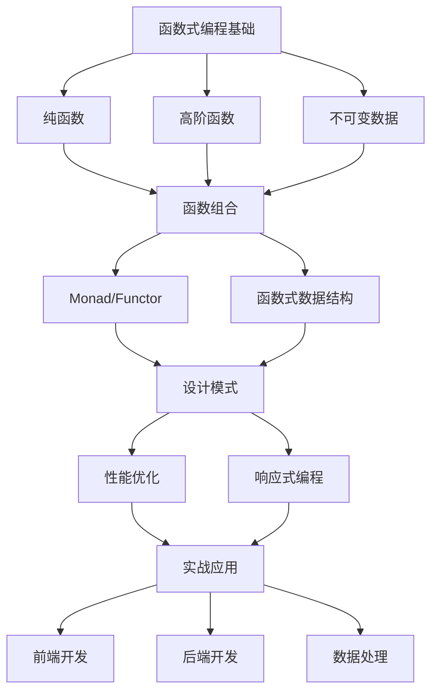

# 🚀 函数式编程深度探索

<div align="center">
  
  
  
</div>

<div align="center">
  <h3>深入浅出的函数式编程指南</h3>
  <p>从理论基础到实际应用的完整学习路径</p>
</div>

---

## 📚 系列文章概览

这个系列包含10篇深入的函数式编程文章，涵盖了从基础概念到高级应用的完整知识体系。

### 🏗️ 基础理论

| 序号 | 文章 | 核心内容 | 难度 |
|------|------|----------|------|
| 1 | [🎯 纯函数：函数式编程的基石](blog-1-pure-functions.md) | 引用透明性、无副作用、可测试性 | ⭐⭐ |
| 2 | [🔧 高阶函数：函数式编程的瑞士军刀](blog-2-higher-order-functions.md) | 函数组合、柯里化、记忆化 | ⭐⭐⭐ |
| 3 | [🛡️ 不可变数据：函数式编程的安全堡垒](blog-3-immutable-data.md) | 持久性、结构共享、并发安全 | ⭐⭐⭐ |

### 🔄 核心概念

| 序号 | 文章 | 核心内容 | 难度 |
|------|------|----------|------|
| 4 | [🔗 函数组合：构建优雅的函数式管道](blog-4-function-composition.md) | compose/pipe、点无风格、组合模式 | ⭐⭐⭐ |
| 5 | [🎭 Monad和Functor：函数式编程的抽象利器](blog-5-monads-and-functors.md) | Maybe、Either、State Monad | ⭐⭐⭐⭐ |
| 6 | [🏗️ 函数式数据结构：不可变世界的构建块](blog-6-functional-data-structures.md) | 持久化结构、HAMT、性能优化 | ⭐⭐⭐⭐ |

### 🎯 高级应用

| 序号 | 文章 | 核心内容 | 难度 |
|------|------|----------|------|
| 7 | [⚡ 函数式响应式编程：异步世界的数据流艺术](blog-7-functional-reactive-programming.md) | Stream、Observable、FRP实践 | ⭐⭐⭐⭐⭐ |
| 8 | [🎨 函数式设计模式：优雅解决复杂问题](blog-8-functional-patterns.md) | 20+设计模式、架构模式 | ⭐⭐⭐⭐ |
| 9 | [⚡ 函数式编程的性能优化：平衡优雅与效率](blog-9-performance-optimization.md) | 性能策略、结构共享、并行处理 | ⭐⭐⭐⭐⭐ |
| 10 | [🌟 函数式编程的实战应用：从理论到实践的桥梁](blog-10-practical-applications.md) | React、Node.js、ETL、实时处理 | ⭐⭐⭐⭐ |

---

## 🎯 学习路径建议

### 初学者路径
```
纯函数 → 高阶函数 → 不可变数据 → 函数组合 → 实战应用
```

### 进阶路径
```
基础概念 → Monad/Functor → 函数式数据结构 → 设计模式 → 性能优化 → 响应式编程
```

### 专业路径
```
理论体系 → 数据结构 → 设计模式 → 性能优化 → 大规模应用 → 架构设计
```

---

## 🛠️ 技术栈覆盖

### 前端技术
- **React**: 函数式组件、Hooks、状态管理
- **Redux Toolkit**: 函数式状态管理
- **RxJS**: 响应式编程
- **TypeScript**: 类型安全的函数式编程

### 后端技术
- **Node.js**: Express中间件、API设计
- **函数式工具库**: Lodash/fp、Ramda
- **数据库**: 函数式查询、不可变存储

### 数据处理
- **ETL管道**: 函数式数据转换
- **流处理**: 实时数据处理
- **并发编程**: 无锁数据结构

---

## 🌟 特色亮点

### 🔥 实用性强
- **100+ 实际代码示例**
- **20+ 设计模式详解**
- **真实项目应用案例**
- **性能优化最佳实践**

### 📚 系统完整
- **从入门到精通**的完整知识体系
- **理论与实践**相结合
- **前沿技术**与传统概念并重
- **代码质量**与性能平衡

### 🎯 适用人群
- **前端开发者**: React/Vue/Angular开发者
- **后端开发者**: Node.js/Java/Python开发者
- **全栈工程师**: 需要全面技能的开发者
- **架构师**: 系统设计决策者
- **学生和研究者**: 理论学习与实践

---

## 🚀 快速开始

### 阅读建议
1. **按顺序阅读**: 建议按照文章编号顺序学习
2. **代码实践**: 每篇文章都有丰富的代码示例
3. **项目应用**: 尝试在实际项目中应用所学概念
4. **社区讨论**: 参与技术讨论，加深理解

### 实践项目
```bash
# 克隆仓库
git clone <repository-url>

# 安装依赖
npm install

# 运行示例代码
npm run examples

# 运行测试
npm test
```

---

## 📊 知识图谱



---

## 🤝 贡献指南

欢迎为这个项目贡献！你可以：

- 📝 **修正错误**: 发现内容错误或改进建议
- 💡 **添加示例**: 贡献更好的代码示例
- 🎨 **优化样式**: 改进文档格式和可读性
- 📚 **扩展内容**: 添加新的主题或深入现有内容

### 如何贡献
1. Fork 这个仓库
2. 创建你的特性分支 (`git checkout -b feature/amazing-feature`)
3. 提交你的修改 (`git commit -m 'Add amazing feature'`)
4. 推送到分支 (`git push origin feature/amazing-feature`)
5. 创建一个 Pull Request

---

## 📄 许可证

本项目采用 MIT 许可证 - 查看 [LICENSE](LICENSE) 文件了解详情。

---

## 🙏 致谢

- 函数式编程社区的贡献者
- 开源项目的维护者
- 所有阅读和学习这些内容的开发者

---

## 📞 联系方式

- **作者**: Claude Code Assistant

---

<div align="center">
  <p>💚 如果这些内容对你有帮助，请给个 ⭐️ Star 支持一下！</p>
  <p>📚 持续更新中，欢迎关注和讨论！</p>
</div>